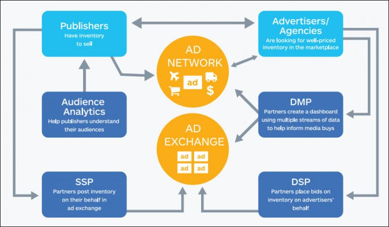

Notes du principe de programmatique
=========================== 

Source : https://www.definitions-marketing.com/definition/dsp/, http://tradelab.com/programmatique/

## Publishers (éditeurs)
Ce sont des éditeurs proposant des espaces publicitaires libres. Exemple : média vidéo ou emplacement publicitaire sur un site WEB...

Ces éditeurs mettent à disposition leurs emplacement sur des SSP.

## SSP
Supply-side platform, est une plateforme mise à disposition des éditeurs pour automatiser la vente de leurs emplacements publicitaires.

## Advertisers (annonceurs)
Ce sont des annonceurs prêts à acheter des emplacements publicitaires numériques afin diffuser leur produits ou leur existance

## DSP
Demand Side Platform, est un plateforme destinée au annonceurs pour suivre l'évolution de leurs emplacements publicitaires réparties dans différents Ad-exchanges.

## DMP 
Data Management Platform, est une plateforme destinée aux annonceurs pour traiter des données des utilisateurs et extraire des profils utilisateurs et segments d'audience.  

## Ad-exchanges et plateformes programmatiques
Un ad-exchange est une plateforme qui permet d'optimiser l'achat et les vente des emplacements publicitaires. Ce sont des places de marché virtuelles entre acheteurs et offreurs.

Les plateformes programmatiques sont une surcouche des ad-exchanges afin d'optimiser les achats publicitaires en fonction des informations utilisateurs, de la visibilité du média etc...

## RTB
Real Time Bidding, est une méthode d'achat d'emplacement publicitaire basée sur le mode des enchères : c'est un type d'achat programmatique. D'autres méthodes de ventes d'emplacements à prix fixes sont aussi disponibles.

